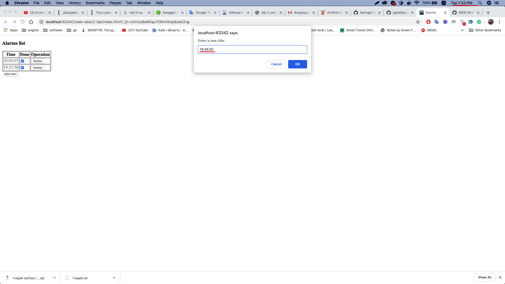
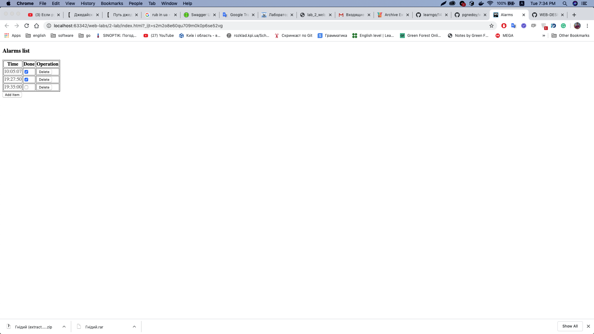
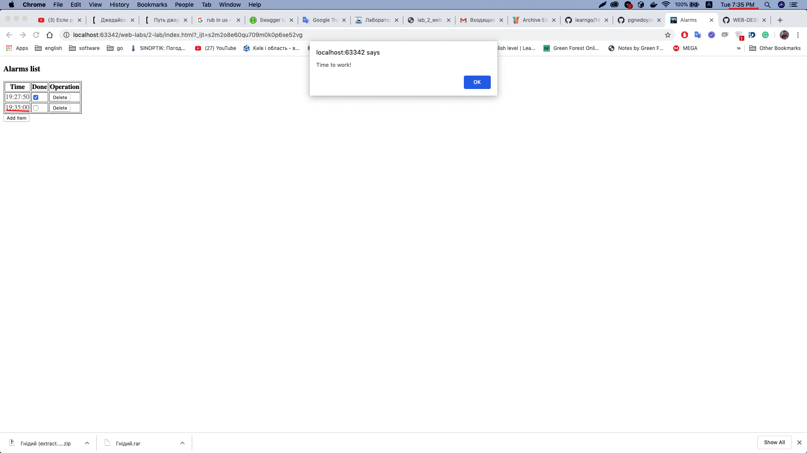

Лабораторна робота номер 3 з дисципліни Web-Design : "Розробка інтерфейсів користувача Web-додатків засобами фреймворку VueJS" .
Гнідий Павло КВ-73.

Варіант 3 - Будильник

Основні функції: увімкнення-вимкнення, введення дати та часу.
Врахувати можливість включення довільної кількості будильників, а також
перегляд «заведених будильників». При досягненні часу спрацьовування,
заданого для будильника, видавати повідомлення. Операції з таймером
здійснювати у фоновому потоці за допомогою WebWorker.

Використав React. 
1. Пояснити переваги використання клієнтських Web-фрейморків:
>1) Вбудований HTML-шаблон: Дані, що відображаються в межах розмітки вашого сайту, є чітко відформатованими та легкими для читання.
>2) Дизайн на основі компонентів: норма подання вмісту сайту за допомогою автономних компонентів є нормою. Це дозволяє повторно використовувати вміст і забезпечує стандартну модель структури контенту та поведінки.
>3) Надійне управління даними: Станом програми керується в моделях даних рамки, а не розкиданими по всій DOM. Більш швидка продуктивність: оновлення вмісту веб-сторінок пишуться лише за необхідності. Контент, який буде наданий, підтримується у віртуальному DOM та надається фактичному DOM, коли відбуваються зміни вмісту.
>4) Підтримка системи побудови: Інструменти збирання дозволяють розробникам використовувати функції ES2015 +, препроцесори, такі як JSX, писати HTML в JS, а також записувати кодові модулі, які в комплекті та мінімізовані для швидкого завантаження. Розробники можуть писати використання нових функцій JavaScript, не побоюючись несумісності застарілого браузера.
